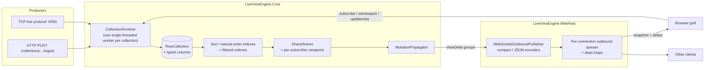

# ViewEngineServer

[](https://github.com/wolszewski/ViewEngineServer/actions/workflows/run-all-tests.yml)

[](LICENSE)

**Live, server-side sorted, filtered and paged views over fast-changing data, streamed to clients over WebSocket.**

ViewEngineServer (built on the `LiveViewEngine.*` libraries) keeps collections of rows in memory, maintains
sort and filter indexes as rows change, and pushes each client only the rows inside its current viewport,
followed by small position-aware deltas (`insert` / `update` / `remove` / `replace`) as the data moves.

Clients don't sort, filter or hold the full dataset. A browser grid can scroll through a million-row blotter
while receiving only the 50 rows on screen plus the changes that affect them. The model is similar to
Lightstreamer's COMMAND mode, but ordering, filtering and paging all happen on the server.

> **Status:** experimental. The engine is in-memory and single-node, with no persistence and no
> authentication. See [Limitations](#limitations).

---

## Contents

- [Features](#features)
- [How it works](#how-it-works)
- [Quick start](#quick-start)
- [WebSocket protocol at a glance](#websocket-protocol-at-a-glance)
- [Ingesting data](#ingesting-data)
- [Embedding the engine](#embedding-the-engine)
- [Configuration](#configuration)
- [Repository layout](#repository-layout)
- [Development](#development)
- [Limitations](#limitations)
- [Documentation](#documentation)
- [License](#license)

## Features

- **Viewport subscriptions.** Subscribe with `sortColumn`, `sortAscending`, `filters`, `startIndex`,
  `pageSize` and a field projection. Scroll or resize with `setviewport`, and change sort or filters in
  place with `updateview`.
- **Minimal reconciliation.** When a viewport grows or slides, `snapshotMode: "delta"` streams only the rows
  the client doesn't already have.
- **Shared views and indexes.** Subscribers with the same sort and filters share one view. Subscribers with
  the same viewport share one computed delta. Sort indexes are reference-counted and removed after a
  grace period once nobody uses them.
- **Typed ordering.** Columns declare a type (`string`, `boolean`, `int`, `long`, `double`, `decimal`,
  `dateonly`, `datetime`, `datetimeoffset`), and sorting and range filters compare typed values. Typed
  columns are only materialized while an index or filter needs them.
- **Two wire formats.** A compact pipe-delimited format (the default) and JSON, chosen per subscription.
- **Two ingest paths.** Use HTTP/JSON for simplicity, or a persistent, schema-aware TCP line protocol for
  throughput. A .NET client library is provided for each.
- **Transport-agnostic core.** `LiveViewEngine.Core` has no ASP.NET, WebSocket or socket dependencies. It can
  be hosted in your own process with a custom `IOutboundPublisher`.
- **Slow clients don't slow the engine.** Per-connection outbound queues decouple the engine from client
  send speed, and stalled clients are detected and disconnected.
- **Observability.** OpenTelemetry metrics for ingest latency, subscription latency, active views and
  indexes, and per-collection queue depth.

## How it works



1. Each collection is owned by a **`CollectionRuntime`** whose single worker processes every command in
   order: upserts, deletes, subscribes and viewport changes. Engine data structures therefore need no locks,
   and every snapshot is consistent with the live stream that follows it.
2. On every mutation the **`MutationPropagator`** finds the row's old and new position in each active view
   and computes the deltas each distinct viewport needs.
3. The host's **`WebSocketOutboundPublisher`** encodes those deltas and hands the frames to per-connection
   queues without blocking. Each connection's drain loop sends at whatever rate the client accepts. Live
   deltas that arrive while a snapshot is streaming are held back until the end of the snapshot.

The full design, including the threading model and snapshot and slow-client handling, is in
[docs/system-design.md](docs/system-design.md).

## Quick start

**Prerequisites:** [.NET 10 SDK](https://dotnet.microsoft.com/download). Docker is optional and only needed
for the container-based Aspire profiles.

```bash
git clone https://github.com/wolszewski/ViewEngineServer.git
cd ViewEngineServer
dotnet build LiveViewEngine.slnx
```

### Option A: full demo (server, trade generator and grid UI)

The Aspire AppHost starts the WebHost, a configurable trade data generator and a browser grid UI:

```bash
dotnet run --project src/examples/LiveViewEngine.Poc.AppHost --launch-profile webhost
```

| Resource | URL |
|---|---|
| Aspire dashboard (logs, metrics) | printed on startup (`http://localhost:15025`) |
| WebHost (HTTP + `/ws`) | `http://localhost:5100` |
| Trade generator (start/stop, rates) | `http://localhost:5101` |
| Grid UI | `http://localhost:5102` |

Other profiles: `webhost-container` runs the WebHost in a resource-limited Docker container,
`loadtest-webhost` adds NBomber Studio for load tests, and `all` adds a Lightstreamer side-by-side
comparison.

### Option B: just the server

```bash
dotnet run --project src/LiveViewEngine.WebHost
# HTTP/WebSocket on http://localhost:5038, TCP ingest on 127.0.0.1:6000
```

**1. Create a collection.** The primary key is implicit. It is always field `key`.

```bash
curl -X POST http://localhost:5038/collections \
  -H "Content-Type: application/json" \
  -d '{
    "collectionName": "trades",
    "fields":     ["symbol", "price",   "quantity"],
    "fieldTypes": ["string", "decimal", "int"]
  }'
```

**2. Ingest rows.** Values are sent and stored as strings. The declared type controls how the value sorts
and filters, and a value that doesn't parse as that type counts as null.

```bash
curl -X POST http://localhost:5038/collections/trades/ingest \
  -H "Content-Type: application/json" \
  -d '{ "operation": "upsert", "primaryKeyValue": "t-1",
        "fields": { "symbol": "AAPL", "price": "150.25", "quantity": "100" } }'

curl -X POST http://localhost:5038/collections/trades/ingest \
  -H "Content-Type: application/json" \
  -d '{ "operation": "upsert", "primaryKeyValue": "t-2",
        "fields": { "symbol": "MSFT", "price": "410.10", "quantity": "5" } }'
```

Only the fields you send are changed. To delete a row, send
`{ "operation": "delete", "primaryKeyValue": "t-1" }`.

**3. Subscribe.** Connect any WebSocket client (for example `npx wscat -c ws://localhost:5038/ws`) and send:

```json
{ "type": "subscribe", "collectionId": "trades", "sortColumn": "price", "sortAscending": false,
  "startIndex": 0, "pageSize": 50, "messageFormat": "json" }
```

You receive an acceptance message, then the snapshot rows, then `eos`:

```json
{"type":"subscriptionAccepted","subscriptionId":1,"snapshotFollows":true,"startIndex":0,"totalCount":2,"fields":["symbol","price","quantity"]}
{"type":"snapshotRow","subscriptionId":1,"rowNumber":0,"row":{"key":"t-2","symbol":"MSFT","price":"410.10","quantity":"5"}}
{"type":"snapshotRow","subscriptionId":1,"rowNumber":1,"row":{"key":"t-1","symbol":"AAPL","price":"150.25","quantity":"100"}}
{"type":"eos","subscriptionId":1}
```

Now upsert `t-1` with `"price": "500.00"`. It moves to the top of the view. Instead of a new page, the
server sends a `rowReplace` (remove from position 1, insert at position 0) followed by a `rowUpdate` with
the changed field:

```json
{"type":"rowReplace","subscriptionId":1,"removedRowId":"t-1","removePosition":1,"insertPosition":0,"row":{"key":"t-1","symbol":"AAPL","price":"500.00","quantity":"100"}}
{"type":"rowUpdate","subscriptionId":1,"rowId":"t-1","position":0,"changedFields":{"price":"500.00"}}
```

Leave out `"messageFormat": "json"` to get the compact format, which carries the same stream in far fewer
bytes:

```text
A|1|1|0|2|symbol|price|quantity
S|1|0|t-2|MSFT|410.10|5
S|1|1|t-1|AAPL|150.25|100
EOS|1
R|1|t-1|1|0|t-1|AAPL|500.00|100
U|1|t-1|0|^1|500.00|^1
```

## WebSocket protocol at a glance

Client to server (`GET /ws`, JSON text messages):

| `type` | Purpose |
|---|---|
| `subscribe` | Open a subscription: `collectionId`, optional `sortColumn`, `sortAscending`, `filters`, `fields`, `startIndex`, `pageSize`, `sendSnapshot`, `messageFormat` (`compact` \| `json`). The server assigns the `subscriptionId`. |
| `setviewport` | Move or resize the viewport: `subscriptionId`, `startIndex`, `pageSize`, `snapshotMode` (`delta` by default, or `full` / `no`). |
| `updateview` | Change the viewport and/or `sortColumn`, `sortAscending`, `filters`, `fields` on an existing subscription. |
| `unsubscribe` | Close a subscription. |

Filter operators: `eq`, `notEq`, `gt`, `gte`, `lt`, `lte`, `contains`. For example,
`"filters": [{ "field": "symbol", "operator": "eq", "value": "AAPL" }]`.

Server to client:

| JSON `type` | Compact | Meaning |
|---|---|---|
| `subscriptionAccepted` | `A` | Subscribe accepted. Carries `totalCount` and the field list, and says whether a snapshot follows. |
| `subscriptionRejected` | `ERR` | Subscribe refused (for example `collection_not_found`). Terminal. |
| `updateRejected` | `UERR` | A `setviewport`/`updateview` was refused. The subscription stays alive. |
| `snapshotStart` | `P` | Start of a snapshot sent after a viewport or view change. |
| `snapshotRow` | `S` | One snapshot row with its absolute `rowNumber`. |
| `eos` | `EOS` | End of snapshot. |
| `rowInsert` | `I` | A row entered the viewport at `position`. |
| `rowUpdate` | `U` | Changed fields of a visible row. |
| `rowRemove` | `D` | A row left the viewport. |
| `rowReplace` | `R` | Atomic remove and insert: a row moved, or one row left while another entered. |

Live-delta positions are **relative to the viewport start**. The full contract, including the compact
encoding, escaping and rejection rules, is in [docs/websocket-protocol.md](docs/websocket-protocol.md) and
[docs/subscription-design.md](docs/subscription-design.md).

## Ingesting data

| Path | When to use | Reference |
|---|---|---|
| `POST /collections`, `POST /collections/{name}/ingest` | Simple integrations, scripts, low rates | [Quick start](#option-b-just-the-server) |
| TCP line protocol on `127.0.0.1:6000` | Persistent high-throughput producers. Field names are sent once, as a schema, and rows use numeric field indexes. | [docs/tcp-ingestion-protocol.md](docs/tcp-ingestion-protocol.md) |

.NET producers can use the client libraries instead of speaking the protocols directly:

```csharp
// TCP: background connection with reconnect, schema caching and a bounded send queue
services.AddLiveViewEngineTcpIngestionClient(o => { o.Host = "127.0.0.1"; o.Port = 6000; });

// later, via ILiveViewEngineTcpClient
await client.CreateCollectionAsync("trades", ["symbol", "price"], ["string", "decimal"], ct);
await client.IngestAsync("trades", "t-1", new Dictionary<string, string?> { ["price"] = "101.25" }, ct);
```

`LiveViewEngine.HttpClient` offers the same operations over HTTP.

## Embedding the engine

The WebHost is one possible host. To serve views over another transport (SignalR, gRPC, a message bus),
reference `LiveViewEngine.Core` and supply an `IOutboundPublisher`:

```csharp
services.AddLiveViewEngineCore(new LiveViewEngineOptions { RequireExplicitCapabilities = true })
    .AddSorting()
    .AddFiltering();
services.AddLiveViewEnginePublisher<MyPublisher>();   // : IOutboundPublisher

// IViewEngine is the whole API surface:
await engine.IngestAsync(new CreateCollectionCommand
{
    CollectionId = "trades",
    Schema = new CollectionSchema("trades", ["symbol", "price"], [ScalarFieldType.String, ScalarFieldType.Decimal])
});
await engine.IngestAsync(new UpsertRowCommand
{
    CollectionId = "trades", Key = "t-1",
    Fields = new Dictionary<string, string?> { ["symbol"] = "AAPL", ["price"] = "150.25" }
});
var snapshot = await engine.SubscribeAsync(new SubscribeCommand
{
    ConnectionId = 1, SubscriptionId = 1, PageSize = 50,
    View = new ViewDefinition { CollectionId = "trades", SortColumn = "price", SortAscending = false }
});
```

`SubscribeAsync` returns the snapshot deltas for the caller to deliver. Every later live delta for that
subscription is pushed through `IOutboundPublisher.PublishAsync`.

## Configuration

The WebHost reads standard ASP.NET Core configuration (`appsettings.json`, environment variables such as
`TcpIngest__Port=7000`, or command-line arguments).

| Section / key | Default | Description |
|---|---|---|
| `LiveViewEngine:SnapshotBatchSize` | `128` | Rows per internal snapshot batch. |
| `LiveViewEngine:StaleIndexGracePeriod` | `00:00:30` | How long an unused sort index or typed column lives before it is removed. |
| `LiveViewEngine:EagerIndexing` | `false` | Build every sort index up front and never remove any. Faster first subscribe, more memory. |
| `LiveViewEngine:TypedColumnKeepAlive` | `WhenReferencedByIndexes` | Keep typed columns alive for indexes only, or also for filters (`WhenReferencedByIndexesAndFilters`). |
| `LiveViewEngine:RequireExplicitCapabilities` | `false` | Reject `sortColumn`/`filters` unless the host called `AddSorting()`/`AddFiltering()`. |
| `WebSocketOutbound:SendStallTimeout` | `00:00:30` | Disconnect a client when a single send makes no progress for this long. |
| `WebSocketOutbound:OutboundQueueCapacity` | `2000000` | Safety cap on queued frames per connection. Exceeding it disconnects the client. |
| `TcpIngest:Enabled` | `true` | Enable the TCP ingest listener. |
| `TcpIngest:ListenAddress` / `Port` | `127.0.0.1` / `6000` | TCP listen endpoint. |
| `TcpIngest:CollectionQueueCapacity` | `100000` | Bounded per-collection TCP ingest queue. A full queue applies backpressure to producers. |
| `TcpIngest:MaxFrameLengthBytes` | `1048576` | Maximum TCP frame size. A larger frame closes the connection. |
| `TcpIngest:EnableAsyncAcks` | `true` | Send `ACK`/`ERR` for `UPSERT`/`DELETE`. |
| `OTEL_EXPORTER_OTLP_ENDPOINT` | unset | OTLP endpoint for metrics (set automatically under Aspire). |

## Repository layout

```text
src/
├── LiveViewEngine.Core/              Engine: storage, indexes, views, delta propagation (no transport deps)
├── LiveViewEngine.Collections/       Order-statistics trees behind the sort indexes
├── LiveViewEngine.WebHost/           ASP.NET Core host: HTTP ingest, TCP ingest, WebSocket publisher
├── LiveViewEngine.TcpProtocol/       TCP line-protocol messages and codec
├── LiveViewEngine.TcpClient/         .NET TCP ingestion client (+ DI hosted service)
├── LiveViewEngine.HttpClient/        .NET HTTP ingestion client
├── LiveViewEngine.Core.Benchmarks/   BenchmarkDotNet suites
├── tests/                            Unit and integration tests (xUnit)
├── loadtests/                        NBomber load tests against /ws
└── examples/                         Aspire AppHost, trade generator, grid UI, Lightstreamer comparison
docs/                                 Design documents and protocol references
```

## Development

```bash
dotnet build LiveViewEngine.slnx
dotnet test  LiveViewEngine.slnx

# micro-benchmarks (interactive selector)
dotnet run -c Release --project src/LiveViewEngine.Core.Benchmarks

# load tests against a WebHost on :5100, the AppHost port (see docs/load-testing.md)
dotnet run --project src/loadtests/LiveViewEngine.WebHost.LoadTests -- --scenario=delta --ingest=tcp
```

CI runs the full build and test suite on every pull request.

## Limitations

- **In-memory and single-node.** There is no persistence, replication or restart recovery. Producers
  re-create collections and re-send their state after a restart.
- **No authentication or TLS.** Put the HTTP/WebSocket endpoint behind a reverse proxy that handles auth.
  TCP ingest binds to loopback by default.
- **Values are strings on the wire and in storage.** Declared types affect ordering and filtering only.
- **At most 128 fields per collection**, including the key.
- **Collections can't be deleted or altered** once created.
- **Large snapshots and slow clients:** snapshots are built in one pass and queued in full, and a client
  that drains slower than its update rate keeps accumulating queued frames until it stalls for
  `SendStallTimeout` or reaches `OutboundQueueCapacity`. Keep `pageSize` bounded for large collections.
  See [Snapshots and slow clients](docs/system-design.md#snapshots-and-slow-clients).

## Documentation

| Document | Contents |
|---|---|
| [docs/system-design.md](docs/system-design.md) | Architecture, threading model, data flow, snapshot and slow-client handling |
| [docs/websocket-protocol.md](docs/websocket-protocol.md) | WebSocket messages in JSON and compact form |
| [docs/subscription-design.md](docs/subscription-design.md) | Subscription lifecycle, snapshot modes and rejection contract |
| [docs/tcp-ingestion-protocol.md](docs/tcp-ingestion-protocol.md) | TCP ingest line protocol |
| [docs/load-testing.md](docs/load-testing.md) | Running the NBomber load tests and NBomber Studio |
| [docs/reviews/](docs/reviews/README.md) | Dated code reviews, used as the backlog of findings |
| [docs/changes/](docs/changes/README.md) | Intent documents for non-trivial changes, and the `intent.md` template |

## License

[MIT](LICENSE) © 2026 Wojciech Olszewski
