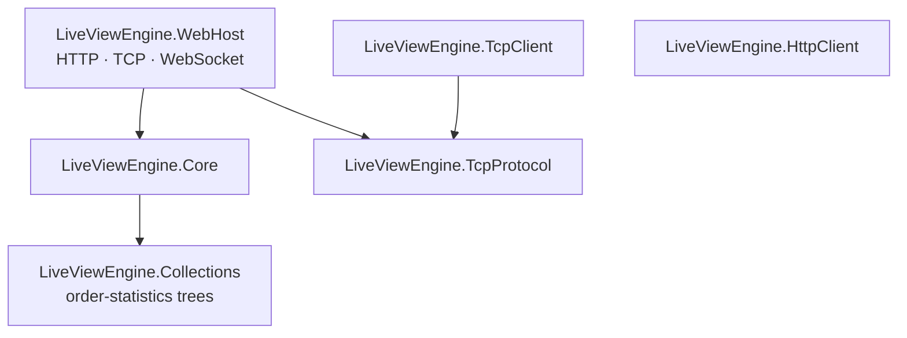
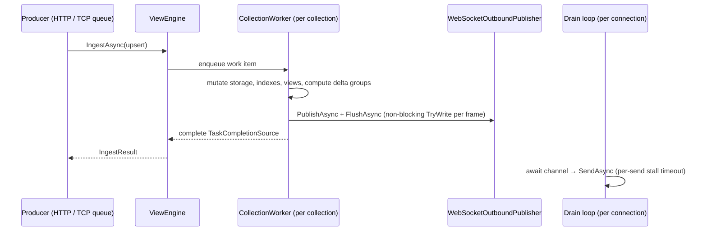

# System design

This document describes how ViewEngineServer is built today: the engine's data structures, its threading
model, how mutations become per-subscriber deltas, and how snapshots and slow clients are handled on the way
out. Wire formats are in [websocket-protocol.md](websocket-protocol.md) and
[tcp-ingestion-protocol.md](tcp-ingestion-protocol.md). Subscription lifecycle rules are in
[subscription-design.md](subscription-design.md).

## Contents

- [Goals](#goals)
- [Project structure](#project-structure)
- [Core engine](#core-engine)
- [Threading model](#threading-model)
- [Data flow](#data-flow)
- [Snapshots and slow clients](#snapshots-and-slow-clients)
- [Observability](#observability)
- [Known issues](#known-issues)

## Goals

- Clients render large, fast-changing, sorted and filtered datasets while holding only their viewport.
- One mutation costs roughly `O(log n)` per distinct active ordering, plus `O(1)` per distinct viewport.
  The cost doesn't grow with the number of subscribers sharing a view.
- A slow or dead client never delays ingest or other clients.
- The engine is transport-agnostic. It can be hosted and tested without HTTP, WebSocket or sockets.

## Project structure



- **`LiveViewEngine.Core`** holds all state and logic. Its public surface is `IViewEngine` (commands in,
  deltas out) plus `IOutboundPublisher` (the host-provided sink for live deltas). It references only
  `Microsoft.Extensions.*` abstractions.
- **`LiveViewEngine.WebHost`** is the reference host. `Http/` maps REST ingest onto `IngestCommand`s. `Tcp/`
  runs the line-protocol listener and per-collection ingest queues. `WebSocket/` runs the session loop, the
  outbound publisher and the compact/JSON encoders.
- **`LiveViewEngine.Collections`** provides `NodeArrayTree`, a cache-friendly B-tree-like order-statistics
  tree (rank ↔ element in `O(log n)`) behind every sort and filtered index.

## Core engine

```text
ViewEngine
 └─ CollectionRuntime (one per collection)
     ├─ CollectionWorker        single consumer that executes every command for the collection
     ├─ RowCollection           key → slot dictionary, SlotList<string?[]> rows, arrival sequence
     │   └─ TypedColumnsCollection   lazily materialized typed copies of columns
     ├─ SortIndexRegistry       NaturalOrderIndex + one SortIndex per sorted field (shared by asc/desc)
     ├─ SharedView (per ViewKey = collection + sort + direction + filters + preset)
     │   └─ FilteredDataIndex   only when the view has filters
     ├─ ViewportState (per subscription): startIndex, pageSize, projection
     └─ MutationPropagator      turns a mutation into delta groups
```

### Storage

`RowCollection` stores each row as a `string?[]` indexed by field position (field `0` is always the primary
key `key`), in a `SlotList` that reuses freed slots. A `Dictionary<string, int>` maps keys to slots. A
per-slot arrival sequence records true insertion order, which the natural-order index uses.

Values are stored as strings. When a sort index or filter needs a typed field (`int`, `decimal`,
`datetimeoffset`, …), `TypedColumnsCollection` materializes a parsed column for it and keeps it updated on
every write. Unparseable values become `null`. Typed columns are reference-counted by the indexes and
filters that use them. When the last reference goes away they are flagged, then removed after
`StaleIndexGracePeriod` (see `TypedColumnKeepAlive`).

### Indexes

| Index | Used for | Update cost |
|---|---|---|
| `NaturalOrderIndex` | Views without `sortColumn` (arrival order). Always present and never reaped. | `O(log n)` on insert/delete. Untouched by updates. |
| `SortIndex` | Views sorted by a field. One per field serves both directions, because descending views read the tree in reverse. | `O(log n)` when the sort field changes. Untouched otherwise. |
| `FilteredDataIndex` | Views with filters. Holds only matching rows, in the parent index's order. | `O(log n)` when membership or order changes. |

All three are `NodeArrayTree`s, so "row at position p" and "position of row r" are both `O(log n)`. On
update, the old sort value is captured before the write (`CaptureOldValue`), so the row can be located at
its old position after its field has changed.

`SortIndexRegistry` reference-counts sort indexes by subscriber. An index with no subscribers is flagged,
and `StaleIndexReaperService` (every 5 s) removes it through the collection worker once the grace period
has passed. `EagerIndexing` builds every index up front and disables reaping.

### Views and viewports

- A **`SharedView`** is one (sort, direction, filters) combination. Every subscription with the same
  `ViewKey` shares it, so ordering and filtering work is done once per view, not once per subscriber.
- A **`ViewportState`** is one subscription's window (`startIndex`, `pageSize`) and projection
  (`SelectedFieldIndexes`, `VisibleColumns` bitmask).

### Mutation propagation

For each upsert or delete, `MutationPropagator`:

1. Groups active views by the position index they sit on.
2. Classifies the mutation per view. On the **fast path**, no sort or filter field changed, so the row's
   position is stable. Otherwise it is a **full recompute**: insert, delete, sort-field change or
   filter-field change.
3. Captures each view's old position, applies the mutation to the position index once, and reads the new
   position.
4. Groups the view's subscribers by identical (viewport, projection), and computes the delta list once per
   group: `RowUpdate`, `RowInsert`, `RowRemove`, or `RowReplace` when one row leaves while another enters
   a full viewport.
5. Updates position indexes that no view is currently using (so they stay correct for future subscribers).

The result is a list of `(deltas, targets)` groups handed to `IOutboundPublisher.PublishAsync`.

### Capabilities

`LiveViewEngineOptions.RequireExplicitCapabilities` makes sorting and filtering opt-in, through
`AddSorting()` / `AddFiltering()`. A disabled capability yields a `subscriptionRejected` (on subscribe) or an
`updateRejected` (on view update), never an exception.

## Threading model



- **One worker per collection.** `CollectionWorker` is an unbounded channel with a single reader. Every
  command that touches a collection's state (upsert, delete, subscribe, view update, unsubscribe, preset
  registration, index reaping) runs on it. Engine data structures are therefore single-threaded and
  lock-free, ordering within a collection is total, and a snapshot is always consistent with the delta
  stream that follows it. Different collections run in parallel.
- **Publishing happens on the worker, before the ingest call completes.** Delta groups are published and
  flushed from the worker, so outbound frames are enqueued in mutation order. `WebSocketOutboundPublisher`
  never awaits the network. It only encodes frames and calls `TryWrite` on bounded channels, so a slow
  client can't stall a worker.
- **Per-subscription command serialization.** `ViewEngine` holds a `SemaphoreSlim` per `(connection,
  subscription)` so two commands for the same subscription can't interleave. Commands from one WebSocket
  are also processed sequentially by its receive loop.
- **Host threads.** Each WebSocket has a receive loop (commands) and a drain loop (sends). Each TCP ingest
  connection has a read loop. Each collection has one TCP ingest consumer (see below).

### Ingest paths

| Path | Queueing | Backpressure | Reply means |
|---|---|---|---|
| HTTP `POST /collections/{name}/ingest` | Request awaits the collection worker directly | None beyond request concurrency (the worker queue is unbounded) | `202`: applied |
| TCP `UPSERT` / `DELETE` | Bounded per-collection channel (`CollectionQueueCapacity`) → single consumer → collection worker | A full channel stops the connection's read loop, which pushes back on the producer's socket | `ACK`: validated and queued, not yet applied |

TCP ordering is preserved per collection because each collection has a single consumer, and that consumer
awaits every `IngestAsync`. Errors raised after queuing (for example on the worker) are logged but not sent
back to the producer.

## Data flow

### Collection creation

```text
POST /collections  |  TCP CREATE
 → IViewEngine.IngestAsync(CreateCollectionCommand)
 → ICollectionStore.TryCreateCollection     creates RowCollection + CollectionRuntime (starts its worker)
 → ViewEngine registers the runtime for routing
```

### Upsert / delete

```text
IngestAsync(Upsert|Delete)
 → CollectionWorker
     CaptureOldValue on every sort index (existing rows)
     RowCollection.AddOrUpdate / Delete            → MutationInfo (slot, isNew, changed-field mask)
     MutationPropagator.Propagate                  → [(deltas, targets)]
     IOutboundPublisher.PublishAsync per group, then FlushAsync
 → IngestResult
```

### Subscribe / view update

```text
WebSocket message
 → WebSocketSessionManager      maps JSON to SubscribeCommand / UpdateViewCommand / UnsubscribeCommand,
                                assigns subscriptionId, configures outbound state for the subscription
 → ViewEngine                   route lock; resolve the collection runtime (or reject)
 → CollectionWorker             validate capabilities, get-or-create SharedView + index,
                                register ViewportState, build snapshot deltas
 → WebSocketSessionManager      subscriptionAccepted / rejected, then publish snapshot deltas
```

## Snapshots and slow clients

### Building a snapshot

A snapshot is built on the collection worker, in the same work item that registers or changes the
viewport:

1. Walk the view from `startIndex` for `pageSize` rows (or to the end of the view when `pageSize` is
   omitted).
2. Copy each row's projected values (`SelectRowValues`) into batches of `SnapshotBatchSize`, as
   `SnapshotRowsDelta`s framed by `SnapshotStartDelta` and `EndOfSnapshotDelta`.
3. Return the whole list to the caller.

Because the copy is taken on the worker, the snapshot is a consistent point-in-time image. Every live delta
the worker produces afterwards applies on top of it.

For viewport changes on an unchanged view with `snapshotMode: "delta"`, only the part of the new window not
covered by the old one is built (`BuildStreamingViewportDeltas`): zero, one or two partial snapshots.
Partial snapshot rows carry absolute `rowNumber`s so clients can splice them in.

### Ordering live deltas around a snapshot

The worker finishes a subscribe before the WebSocket session writes its snapshot to the socket. In that gap,
new mutations can already produce live deltas for the subscription. `WebSocketOutboundPublisher` keeps
per-subscription state (`SubscriptionState`) so those deltas can't overtake the snapshot:

- **Subscribe:** before dispatching, the session marks the subscription *snapshot-active*
  (`ConfigureSubscription`).
- **View update:** the flag is set from the worker itself, immediately before the update executes
  (`onBeforeProcess` → `BeginViewportSnapshot`), so the switch point is exact.
- While snapshot-active, live deltas are encoded and parked in `BufferedFrames` instead of the connection
  queue.
- The session then writes `subscriptionAccepted` (for an initial subscribe, this carries the
  `snapshotStart` data), followed by the snapshot rows and `eos`. Enqueuing `eos` clears the flag and moves
  the parked frames into the connection queue.
- If the command fails or is rejected after the flag was set, `CancelSnapshot` clears it and releases the
  parked frames, so the subscription never stays muted.

`SubscriptionState` also tracks the expected next `rowNumber` and logs a warning if a snapshot stream ever
has a gap or overlap.

### Outbound queue and drain loop

Each connection (`WebSocketConnection`) owns a bounded `Channel<byte[]>` (`OutboundQueueCapacity`, default
2,000,000 frames) and a drain task:

- Producers (collection workers and the session loop) call `TryWrite`, which never blocks. Every protocol
  message is one frame and one WebSocket message.
- The drain loop sends frames one at a time. Each `SendAsync` has its own `SendStallTimeout` (default 30
  s). This timeout is the primary slow-client detector: it measures whether the client is making progress,
  not how much data it asked for, so a large snapshot to a healthy client succeeds whatever its size.
- The connection is **faulted** (queue completed, socket aborted, receive loop unblocked, subscriptions
  cleaned up) when a send stalls past the timeout, a send fails, the socket is no longer open, or
  `TryWrite` finds the queue full. `Fault` is idempotent and logs once, with frames written and sent.

### Live-delta coalescing

`LiveDeltaCoalescer` can merge pending deltas for a subscription: consecutive updates to one row, and
insert/remove pairs that cancel out. It is bounded at 64 pending deltas per subscription
(`OutboundFlushPolicy`). In practice the engine calls `FlushAsync` after every mutation, so coalescing only
ever sees the deltas of a single mutation and doesn't reduce traffic to slow clients.

### Current limits

These follow from the design above and matter when sizing a deployment:

- **A slow-but-progressing client grows without bound.** A client that accepts data slower than its update
  rate, but never stalls a single send for `SendStallTimeout`, keeps accumulating frames until
  `OutboundQueueCapacity` is reached. Nothing conflates or drops intermediate updates, and no byte-based
  budget applies. The worst case is roughly `OutboundQueueCapacity × frame size` per connection.
- **Snapshots are bounded only by `pageSize`,** and clients may omit it. The whole snapshot is copied on the
  collection worker (ingest for that collection waits meanwhile), then encoded into the connection queue in
  one go. A snapshot with more rows than `OutboundQueueCapacity` always faults the connection.
- **Snapshot rows are sent one WebSocket message each.** Large snapshots cost one `SendAsync` and one
  allocation per row.
- **Frames are encoded per subscriber.** Subscribers are grouped so each delta is computed once, but frames
  embed the subscription id, so each target's frames are encoded separately, on the collection worker.
- **`FlushAsync` walks every connection** (taking each connection's lock) after every mutation in any
  collection.

## Observability

Metrics are published on the `ViewEngineServer` meter and exported via OTLP from the WebHost, together with
ASP.NET Core, runtime and process instrumentation:

| Instrument | Type | Tags |
|---|---|---|
| `viewengine.insert.duration`, `viewengine.update.duration` | histogram (ms) | `collectionId` |
| `viewengine.insert.count`, `viewengine.update.count` | counter | `collectionId` |
| `viewengine.subscription.duration` | histogram (ms) | command type, `collectionId` |
| `viewengine.active_subscriptions`, `viewengine.active_shared_views` | up-down counter | `collectionId` |
| `viewengine.active_sort_indexes` | gauge | |
| `viewengine.typed_columns.ref_count` | gauge | `collectionId`, `fieldName` |
| `viewengine.collection.channel_depth` | gauge | `collectionId` |

Outbound queue depth, parked snapshot frames and slow-client disconnects are currently reported only in
logs (`WebSocketConnection` warnings).

## Known issues

Verified defects, to be fixed. Details, proposed fixes and status tracking are in
[reviews/2026-09-12-architecture-review.md](reviews/2026-09-12-architecture-review.md) (AR-01 to AR-08).
Remove each entry here when its fix ships.

- **Compact `A` frame without a snapshot.** It has an extra empty token, which shifts `startIndex`,
  `totalCount` and the field list (`CompactOutboundProtocolEncoder.EncodeSubscriptionAccepted`).
- **Compact encoding breaks non-BMP characters.** It encodes one UTF-16 code unit at a time, so emoji
  arrive as `U+FFFD` pairs (`CompactOutboundProtocolEncoder.WriteEscaped`).
- **Compact key-only projections.** For `fields: []`, row encoding throws. The error is logged and the rows
  are dropped (`OutboundProtocolEncodingHelpers.GetPayloadFieldIndexes` falls back to all fields).
- **Duplicate collection creates leak a runtime.** `CollectionStore.TryCreateCollection` constructs a
  `CollectionRuntime`, which starts its worker, before `TryAdd`, and never disposes it when the name
  already exists. Producers that "create if missing" on every start leak one runtime per start.
- **Some invalid requests close the WebSocket.** Exceptions from the engine (an unknown name in `fields`,
  `updateview` on a subscription the engine no longer knows) and `"type": null` escape the receive loop.
  The socket closes with no error frame.
- **Unknown `fieldPresetId`.** The subscribe is acknowledged as accepted, with no snapshot, but no
  subscription is created. A later `updateview` for it closes the connection.
- **Live deltas can precede `subscriptionAccepted`.** With `sendSnapshot: false` the subscription is never
  snapshot-active, so live deltas can reach the client first.
- **Schemas over 128 fields.** Schemas with more than 128 fields (including the key) are accepted, but
  `FieldMask` supports only 128. Writes to later fields, and subscriptions that project them, throw.
